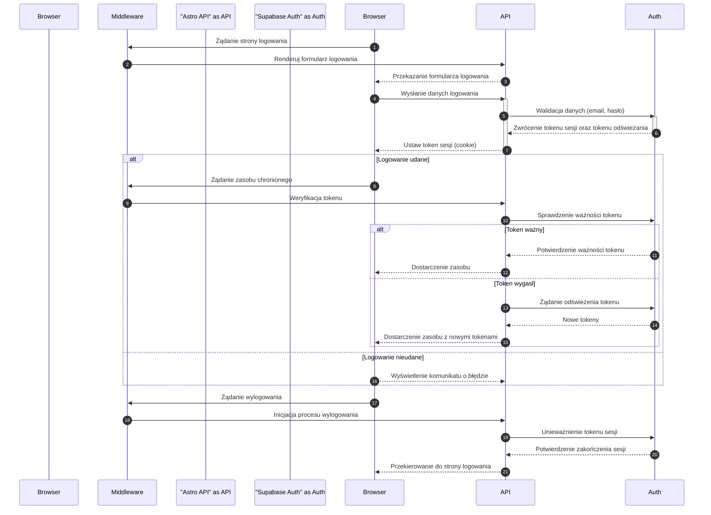

<authentication_analysis>

- Proces logowania: Użytkownik wprowadza email i hasło, które są walidowane przez API poprzez Supabase Auth, generujący token sesji oraz token odświeżania.
- Proces rejestracji: Użytkownik podaje dane rejestracyjne, a system tworzy konto i generuje token.
- Proces odzyskiwania hasła: Użytkownik wprowadza email, a system wysyła link resetujący.
- Zarządzanie sesją: Middleware weryfikuje ważność tokenu przy każdym żądaniu. W przypadku wygaśnięcia, API żąda od Supabase Auth odświeżenia tokenu.
- Proces wylogowania: Użytkownik inicjuje wylogowanie, a system unieważnia tokeny i kończy sesję.
  Główni aktorzy: Przeglądarka, Middleware, Astro API oraz Supabase Auth.
  </authentication_analysis>

<mermaid_diagram>

</mermaid_diagram>
