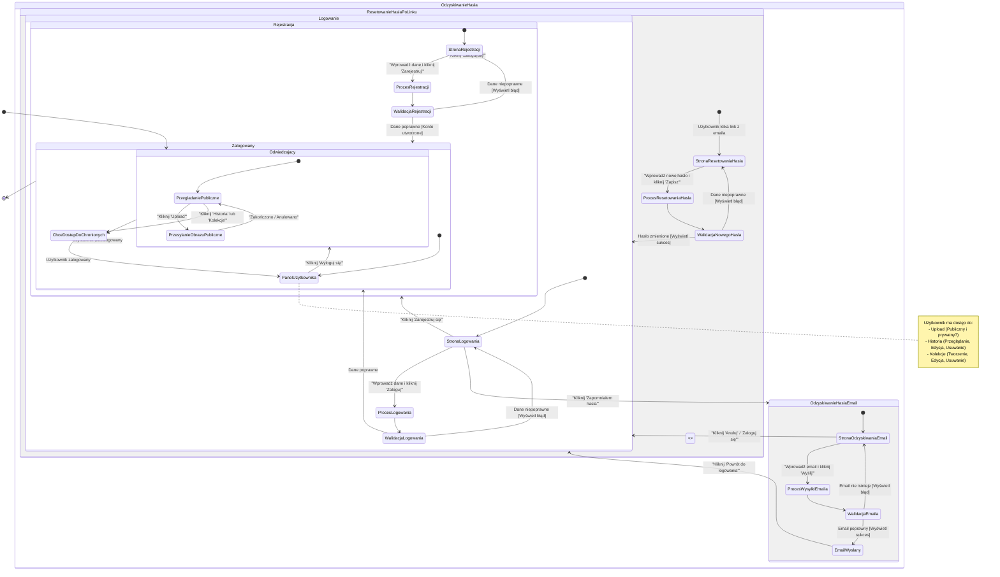

## Analiza Podróży Użytkownika

### Ścieżki użytkownika:

- Użytkownik wchodzi na stronę główną jako gość.
- Gość może korzystać z publicznej funkcji przesyłania obrazu (ad-hoc upload, US-001).
- Gość próbuje uzyskać dostęp do Historii (US-002) lub Kolekcji (US-005) -> zostaje przekierowany na stronę logowania (US-006).
- Na stronie logowania użytkownik może:
  - Wprowadzić dane i spróbować się zalogować.
  - Przejść do strony rejestracji.
  - Przejść do strony odzyskiwania hasła.
- **Logowanie (US-006):** Podanie emaila i hasła -> Walidacja -> Sukces (zalogowany) / Porażka (błąd logowania).
- **Rejestracja (US-006):** Podanie emaila, hasła, potwierdzenia hasła -> Walidacja -> Sukces (konto utworzone, użytkownik zalogowany) / Porażka (błąd rejestracji). _Zakładam brak kroku potwierdzenia email zgodnie z PRD/Spec, ale Supabase może go domyślnie wymuszać - diagram można dostosować, jeśli będzie taka potrzeba._
- **Odzyskiwanie hasła (US-006):** Podanie emaila -> Walidacja -> Email z linkiem wysłany / Błąd -> Użytkownik klika link w emailu -> Strona resetowania hasła -> Podanie nowego hasła -> Sukces (hasło zmienione, przekierowanie do logowania) / Porażka.
- **Zalogowany użytkownik:** Może korzystać ze wszystkich funkcji (Upload, Historia - US-002, Edycja - US-003, Usuwanie - US-004, Kolekcje - US-005). Może się wylogować.
- **Wylogowanie (US-006):** Kliknięcie przycisku "Wyloguj się" -> Sesja zakończona -> Powrót do stanu gościa na stronie głównej.

### Główne podróże i stany:

- **Gość:** Stan początkowy, dostęp do publicznych funkcji.
- **Proces Autentykacji:** Obejmuje logowanie, rejestrację i odzyskiwanie hasła.
- **Zalogowany Użytkownik:** Stan po pomyślnej autentykacji, pełen dostęp.

### Punkty decyzyjne:

- Potrzeba dostępu do funkcji chronionych.
- Wybór akcji na stronie logowania (Login / Register / Forgot Password).
- Wynik walidacji danych (Sukces / Porażka).

### Cel każdego stanu:

- **Odwiedzający (Gość):** Umożliwia interakcję z publiczną częścią aplikacji.
- **StronaLogowania:** Punkt wejścia do procesów autentykacji.
- **StronaRejestracji:** Umożliwia utworzenie nowego konta.
- **StronaOdzyskiwaniaHasla:** Inicjuje proces resetowania hasła przez email.
- **StronaResetowaniaHasla:** Pozwala użytkownikowi ustawić nowe hasło po kliknięciu linku.
- **Zalogowany:** Zapewnia dostęp do pełnej funkcjonalności aplikacji.
- **KomunikatBledu:** Informuje użytkownika o problemie.
- **KomunikatSukcesu:** Informuje użytkownika o pomyślnym zakończeniu akcji (np. wysłaniu emaila).

## Diagram Podróży Użytkownika

