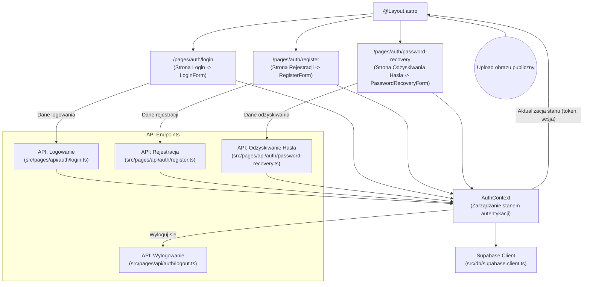

<architecture_analysis>

- Komponenty:

  - Strony Astro:
    - /pages/auth/login – Strona logowania
    - /pages/auth/register – Strona rejestracji
    - /pages/auth/password-recovery – Strona odzyskiwania hasła
  - Komponenty React (z użyciem Shadcn/ui):
    - LoginForm, RegisterForm, PasswordRecoveryForm
    - AuthContext – mechanizm zarządzający stanem autentykacji
  - Główny Layout:
    - @Layout.astro – dynamiczne przyciski (Login, Rejestracja, Wyloguj się) oraz zabezpieczenie stron chronionych
  - API Endpoints:
    - src/pages/api/auth/register.ts (rejestracja)
    - src/pages/api/auth/login.ts (logowanie)
    - src/pages/api/auth/logout.ts (wylogowywanie)
    - src/pages/api/auth/password-recovery.ts (odzyskiwanie hasła)
  - Supabase Client:
    - src/db/supabase.client.ts – integracja z Supabase Auth

- Przepływ danych:

  - Użytkownik wprowadza dane w formularzach (LoginForm, RegisterForm, PasswordRecoveryForm)
  - Formularze przesyłają dane do odpowiednich API Endpointów
  - API komunikuje się z Supabase (przez Supabase Client) i zwraca token/sesję
  - AuthContext aktualizuje stan autentykacji, co wpływa na dynamiczny interfejs @Layout.astro

- Opis funkcjonalności:
  - LoginForm: Pobiera dane logowania i wysyła do API logowania; otrzymuje token, aktualizuje AuthContext
  - RegisterForm: Zbiera dane rejestracji, weryfikuje je, wysyła do API rejestracji; po sukcesie tworzy nowy stan autentykacji
  - PasswordRecoveryForm: Umożliwia wysyłkę danych do API odzyskiwania hasła, które wysyła email z linkiem resetującym
  - @Layout.astro: Wyświetla dynamiczne przyciski i zabezpiecza dostęp do chronionych stron (historia optymalizacji, kolekcje)
    </architecture_analysis>

<mermaid_diagram>

</mermaid_diagram>
